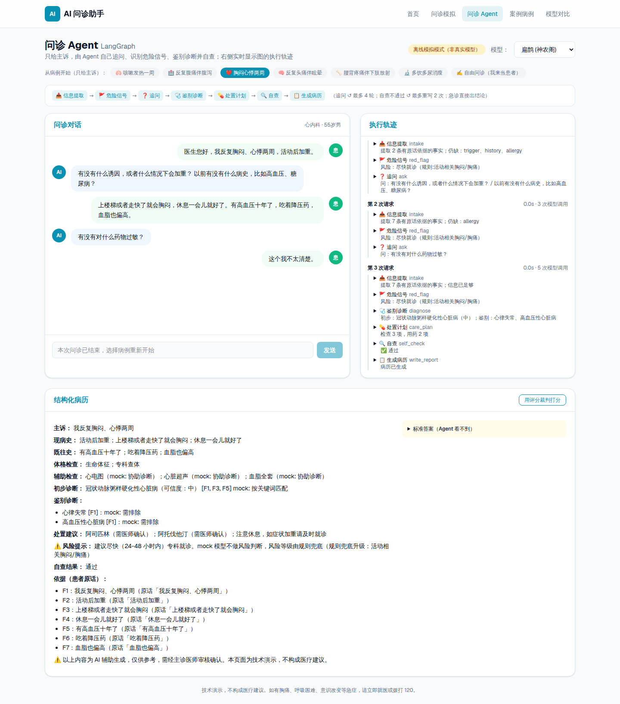

# AI 问诊助手 · 智能体演示

Next.js 16 + Vercel AI SDK + Vercel AI Gateway 的医疗问诊演示，部署在 Vercel。

| 页面 | 说明 |
|---|---|
| `/consultation` | 问诊模拟：手动输入医患对话，一次生成结构化病历 |
| `/cases` | 6 个多科室病例，带标准答案 |
| `/comparison` | 多模型对比，由 LLM 裁判打分 |
| **`/agent`** | **问诊 Agent（LangGraph）**：只给主诉，agent 自主追问、识别危险信号、鉴别诊断、自查，实时显示执行轨迹 |



## 问诊 Agent

```
intake → red_flag ─┬─ 急诊 ─────────────────────────────────────▶ write_report
                   ├─ 信息不足 → ask ─(模拟患者)→ intake  (≤4 轮)
                   └─ 足够 → diagnose → care_plan → self_check ─┬─ 通过 ─▶ write_report
                                ▲                                │
                                └──────── 不通过（≤2 次）─────────┘
```

- **LangGraph** 负责流程：追问环、自查环、急诊短路，所有循环都有上限
- **LangChain** 负责调用：`ChatOpenAI` 走 AI Gateway 的 OpenAI 兼容接口，`withStructuredOutput` + zod
- 防编造：事实必须能在患者原话中找到，诊断必须引用事实编号，病历由代码渲染
- 无状态：每次请求带完整对话，适配 Vercel Serverless

文档：
- [架构](docs/agent/ARCHITECTURE.md)
- [框架对比笔记](docs/agent/FRAMEWORKS.md)
- [评估](docs/agent/EVAL.md)
- [Roadmap 与完成情况](docs/agent/ROADMAP.md)
- [3 分钟讲解稿](docs/agent/PITCH.md)

## 本地运行

```bash
npm install
cp .env.example .env.local   # 填入 AI_GATEWAY_API_KEY
npm run dev
```

没有 key 也能看 agent 的完整流程：在 `.env.local` 写 `AGENT_MOCK=1`，agent 相关页面和接口会改用离线的确定性 mock（页面上会标「离线模拟模式」）。

```bash
npm test          # 单元与图路由测试（离线）
npm run lint
npm run typecheck
```

## 评估

```bash
npx tsx scripts/eval-agent.ts --mock                          # 离线验证评测流程
npx tsx scripts/eval-agent.ts --model gpt-4o-mini --runs 3    # 真实模型
```

比较三种条件：单次调用（完整对话）、单次调用（仅主诉）、agent 与模拟患者对话。三者由同一个裁判打分。详见 [EVAL.md](docs/agent/EVAL.md)。

## 框架实验

`experiments/` 里有 LangChain、LangGraph、CrewAI 的最小 demo，以及 CrewAI 版本的同任务实现（`crewai/crew_eval.py`，医生 agent 通过委派向患者 agent 提问）。见 [experiments/README.md](experiments/README.md)。

---

本项目为技术演示，不构成医疗建议。
