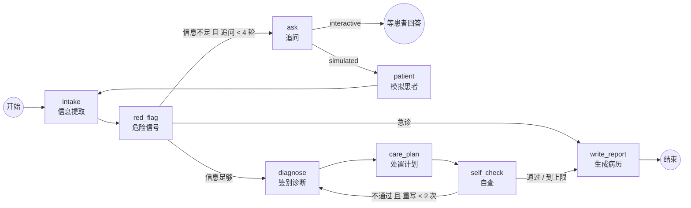

# 问诊 Agent 架构

## 一张图



代码：`src/lib/agent/graph.ts`。状态定义在同一文件的 `ConsultationState`。

## 节点

| 节点 | 做什么 | 模型 | 确定性部分 |
|---|---|---|---|
| `intake` | 从对话里提取事实（带分类）、列出缺失信息、判断是否够用 | ✅ 结构化输出 | 每条事实的 `quote` 必须在患者原话里逐字出现，否则丢弃（`grounding.ts`） |
| `red_flag` | 判断风险等级 routine / urgent / emergency | ✅ | 正则规则（`red-flags.ts`）只能**升级**风险，不能降级；带否定词检测 |
| `ask` | 生成 1-2 个追问 | ✅ | 轮数上限 `MAX_ASK_ROUNDS = 4`，由 transcript 里 agent 发言数计算 |
| `patient` | 仅评测/演示：模拟患者回答 | ✅ | 只能引用病例原对话 |
| `diagnose` | 初步诊断 + 鉴别诊断，每条引用事实 id | ✅ | — |
| `care_plan` | 查体、检查、用药、建议 | ✅ | — |
| `self_check` | 质控：编造、过度自信、漏掉危险信号、用药冲突、自相矛盾 | ✅ | 先跑确定性检查：引用了不存在的事实 id、诊断无依据、urgent 却没写尽快就诊 |
| `write_report` | 渲染最终病历 | ❌ | **纯代码渲染**，格式与原评分裁判一致 |

## 几个关键设计

**1. 模型只产出结构，最终文字由代码渲染。**
每个节点的输出都是 zod 校验过的对象。病历里出现的每条事实都带原话，每个诊断都带事实编号。模型没有机会在最后一步「顺手」加一句没有依据的话。

**2. 防编造分两层。**
- 确定性：事实的 `quote` 找不到原话就丢；诊断引用不存在的 id 就打回。
- 模型：`self_check` 让另一个 prompt 做质控，不通过就带着具体问题回到 `diagnose`。

**3. 安全相关的逻辑不交给模型「商量」。**
危险信号走条件边直接出急诊提示，跳过诊断。正则兜底只升不降：模型漏判时规则能补上，模型误判为急诊时规则不会压下来。

**4. 所有循环都有硬上限。**
追问最多 4 轮，自查最多重写 2 次，另有 `recursionLimit = 60`。最坏情况的模型调用次数可以算出来，Vercel 函数设了 `maxDuration = 60`。

**5. 无状态，适配 Vercel。**
Serverless 函数之间不共享内存，所以没用 `interrupt()` + `MemorySaver`（demo 2 演示过这个模式）。每次请求由前端带上完整对话，图从 `intake` 重新推一遍；`ask` 之后在 interactive 模式下直接结束，等下一次请求。代价是每轮多一次 `intake` 调用，换来不需要数据库。要做长会话，可以换成 Postgres checkpointer。

**6. 同一张图，两种模式。**
`mode: "interactive"`（网页，真人回答）和 `mode: "simulated"`（评测，模拟患者在图内回答，形成真正的环）。评测跑的就是线上的同一份代码。

## 技术栈

| 层 | 用什么 |
|---|---|
| 编排 | `@langchain/langgraph` 的 `StateGraph`、`Annotation` reducer、条件边、`streamMode: ["updates", "values"]` |
| 模型调用 | `@langchain/openai` 的 `ChatOpenAI`，`baseURL` 指向 Vercel AI Gateway 的 OpenAI 兼容接口，`withStructuredOutput(zod, { method: "functionCalling", includeRaw: true })`（`includeRaw` 用于统计 token） |
| API | `POST /api/agent`：SSE，每个节点一条 `data:` 事件；`POST /api/agent/patient`：模拟患者 |
| 前端 | `/agent` 页面，读 SSE，渲染执行轨迹、图、病历、评分 |
| 离线 | `AGENT_MOCK=1`：确定性 mock LLM + 脚本患者，用于测试和无 key 演示 |

## 请求流

```
浏览器                        /api/agent (Vercel Function)                 AI Gateway
  │  POST {transcript, model}        │                                          │
  │ ───────────────────────────────▶ │ buildConsultationGraph({mode:interactive})│
  │                                  │ graph.stream(...)                        │
  │                                  │   intake ───────────────────────────────▶│
  │ ◀── data:{type:node,intake} ──── │                                          │
  │                                  │   red_flag ─────────────────────────────▶│
  │ ◀── data:{type:node,red_flag} ── │                                          │
  │                                  │   ask ──────────────────────────────────▶│
  │ ◀── data:{type:node,ask} ─────── │                                          │
  │ ◀── data:{type:done,state} ───── │  (END：等患者回答)                        │
  │  患者回答后，带完整 transcript 再 POST 一次 …                                 │
```

## 测试

`npm test`（`tests/`）：
- 事实落地、危险信号规则（含否定词），以及 6 个病例的预期风险等级
- 图路由：interactive 在 `ask` 后停下、急诊短路、自查打回一次后通过、一直不通过时停在上限、引用不存在 id 被拦截、追问轮数上限
- 真实 LangChain 路径：起一个本地的 OpenAI 兼容服务器，验证请求路径、鉴权头、强制 tool call、结构化解析、token 统计，以及模型不按格式回复时抛错
- Phase 0 的两个修复：流解析、评分失败显式报错
